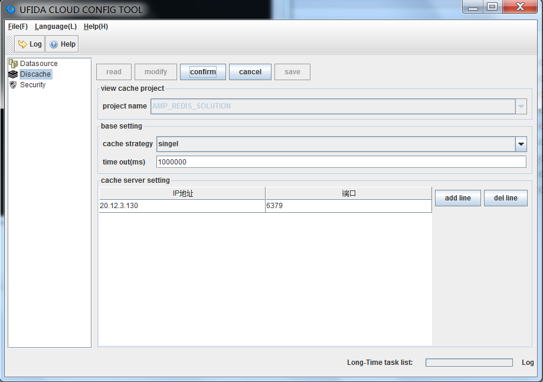

## controller安装 {#controller}

### windows环境下安装 {#windows}

windows环境下的安装包为coord_controller.exe。安装步骤如下：

1.  将文件coord_controller.exe拷贝到待安装的目录并点击打开文件，得到cloudcontroller文件夹。
2.  进入cloudcontroller\bin文件夹，打开sysConfig.bat文件，进入如下界面。

图4-16 

####CTRL配置

1.  点击Datasource，进入数据库配置。点击read，读取配置信息，然后修改数据库连接信息。确认保存后，初始化数据库。注意：数据库的初始化是一个重要的过程请谨慎操作。

图4-17 

####Datasource配置

1.  点击Discache，进入缓存配置。点击read，读取缓存配置信息，然后修改缓存信息。其中“project name ”栏有3个选项分别是1）AMP_REDIS_SOLUTION_LAN 2）AMP_REDIS_SOLUTION 3）AMP_REDIS_SOLUTION_SSP 。其中1）对应的cache server setting中的IP地址配置为redis安装的机器的IP（内网ip地址，不能配置为127.0.0.1）；2）对应的ip地址为外网访问的redis ip地址和端口号；3）为需要连接到的ssp端的缓存配置（ip默认为ts.yonyou.com，端口默认为6379）。然后确认保存。

图4-18 

####Discache配置

1.  点击Security，进入安全令牌配置。点击read，读取令牌安全配置信息。重置安全令牌后，保存。

图4-19 

####Security配置

1.  修改cloudcontroller\ierp\bin\receiverconf.properties中的receiver*地址（内网ip地址，不能配置为127.0.0.1）和端口为本机。如：

  receiver=20.1.85.1:5044

  receiverzip=20.1.85.1:5046

  receiverlan=20.1.85.1:5044

  receiverlanzip=20.1.85.1:5046

1.  修改端口。如果要修改controller的端口，可以修改cloudcontroller\ierp\bin\monitorconf.xml文件中cc__port对应的位置（默认端口为80）。推荐端口值为7681。
2.  启动controller。执行cloudcontroller中的startController.bat文件。
3.  停止controller。执行cloudcontroller中的stopController.bat文件。
4.  若不能使用sysConfig.bat启动的图形界面进行数据库、消息队列和安全令牌的配置，则需要手动修改相关文件。具体操作请查看第5章CTRL和MA的配置问题。

### linux环境下安装 {#linux}

linux环境下的安装包为coord_controller.tar。

*   *   1.  在amp中解压coord_controller.tar文件，得到cloudcontroller文件夹。
        2.  进入cloudcontroller/bin文件夹，打开sysConfig.sh文件，进入如下界面。

图4-20 

####CTRL配置

点击Datasource，进入数据库配置。点击read，读取配置信息，然后修改数据库连接信息。确认保存后，初始化数据库。

图4-21 

####Datasource配置

点击Discache，进入缓存配置。点击read，读取缓存配置信息，然后修改缓存信息。cache server setting中的IP地址配置为redis安装的机器的IP。其他说明同4.4.1中的4），然后确认保存。

图4-22 

####Discache配置

点击Security，进入安全令牌配置。点击read，读取令牌安全配置信息。重置安全令牌后，保存。

图4-23 

####Security配置

修改cloudcontroller/ierp/bin/receiverconf.properties中的receiver*地址（内网ip地址，不能配置为127.0.0.1）和端口为本机。如：

receiver=20.1.85.1:5044

receiverzip=20.1.85.1:5046

receiverlan=20.1.85.1:5044

receiverlanzip=20.1.85.1:5046

1.  修改端口。如果要修改controller的端口，可以修改cloudcontroller/ierp/bin/monitorconf.xml文件中cc__port对应的位置（默认端口为80）。推荐端口值为7681。
2.  启动controller。执行/cloudcontroller中的startController.sh文件。
3.  停止controller。执行/cloudcontroller中的stopController.sh文件。

若不能使用sysConfig.sh启动的图形界面进行数据库、消息队列和安全令牌的配置，则需要手动修改相关文件。具体操作请查看第5章CTRL和MA的配置问题。