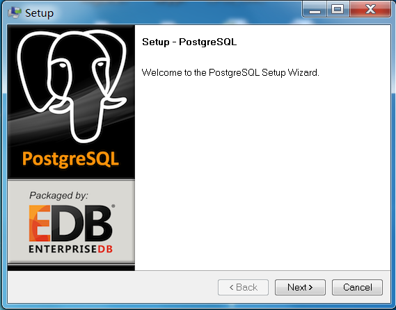
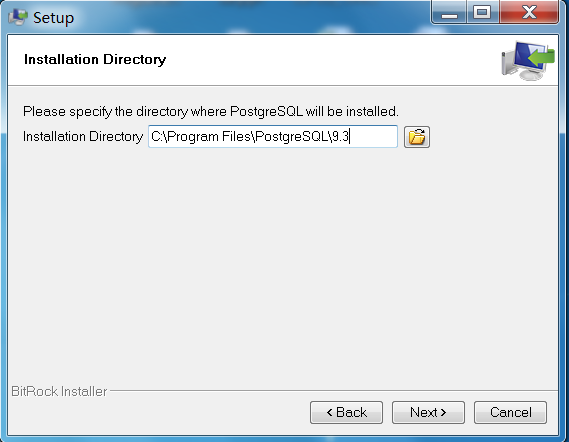
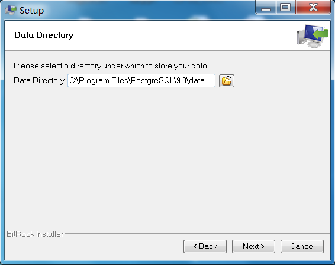
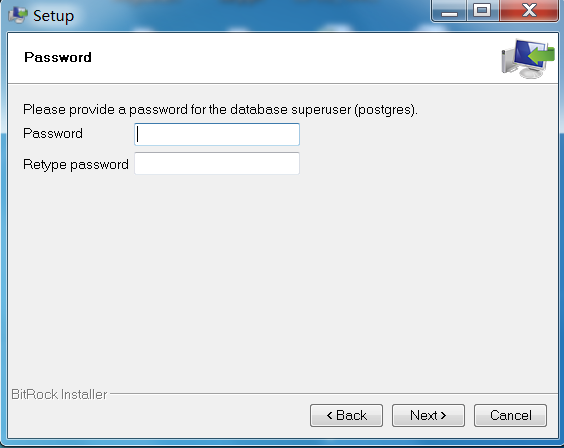
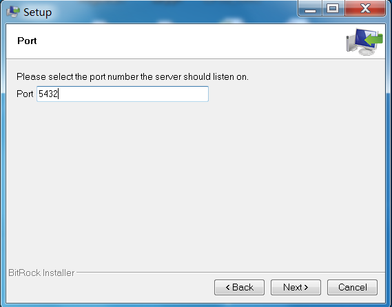
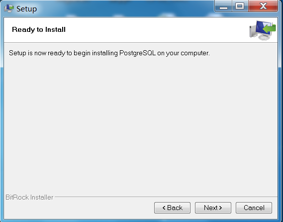
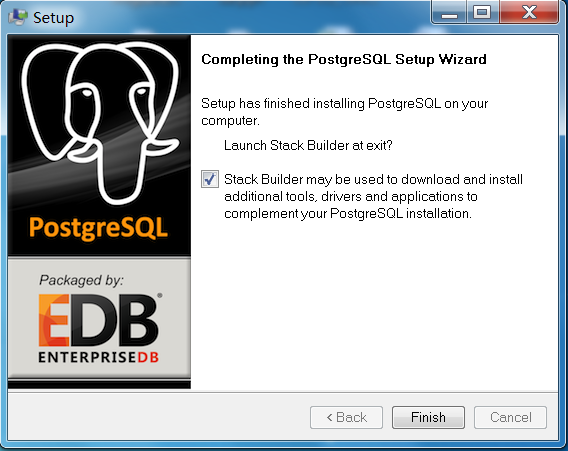
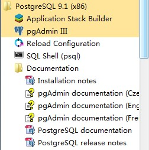
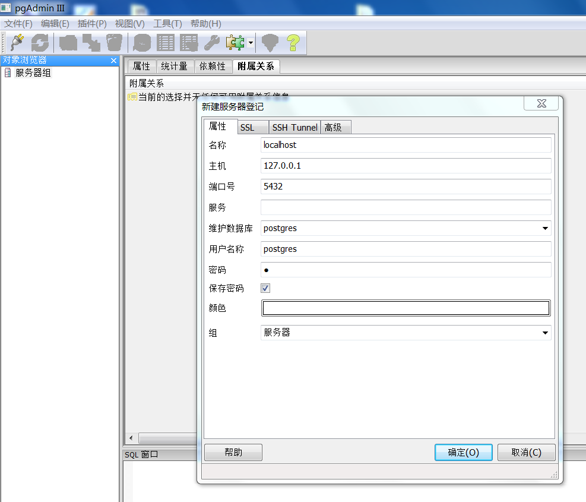

## 数据库安装

### windows版本安装 {#windows}

windows版本的安装包分为32位安装包和64位安装包，对应的安装包为postgresql-9.4.5-1-windows.exe和postgresql-9.4.5-1-windows-x64.exe，用户可根据自己的操作系统选择对应的安装包；下面以64位操作系统为例进行安装。

*   1.  执行安装包文件，会出现如下界面，然后点击**〖**next**〗**。

图4-03 安装第一步

*   1.  出现如下界面，选择安装路径，然后点击**〖**next**〗。**

图4-04 选择安装路径

*   1.  出现如下界面，选择数据保存路径，然后点击**〖**next**〗。**

图4-05 选择数据存储路径

*   1.  出现如下界面，输入数据库的密码，然后点击**〖**next**〗。**

图4-06 输入用户名和密码

*   1.  出现如下界面，输入数据库的端口号；注意，端口一般都会是默认5432的，请不要随便修改，否则会导致系统出现问题。然后点击**〖**next**〗。**

图4-07 选择端口号

*   1.  出现如下界面，选择安装的语言，一般都会用简体中文，然后点击**〖**next**〗。**

图4-08 选择语言

*   1.  出现如下界面，确认安装配置，准备安装，点击**〖**next**〗**开始安装**。**

图4-09 准备安装

*   1.  安装完成**。**如果需要安装stack builder，则勾选；这里不需要，所以不需要勾选。点击**〖**finish**〗**完成安装。

图4-10 安装完成

*   1.  安装完成后，通过windows操作系统的“开始”工具栏找到如下目录。打开pgAdminⅢ，进入PostgreSQL自带的可视化工具。

图4-11 安装目录

*   1.  进入如图界面，添加服务器，如下配置，然后确认添加。

图4-12 数据库配置

*   1.  在数据库目录下新建数据库soma，为以后平台的基本数据库。完成后如图，至此安装完成。

图4-13 新建数据库

### linux版本安装 {#linux}

Linux版本的安装包为postgresql-9.4.5-1-linux-x64.run。安装步骤如下：

1.  将安装包拷贝至/amp文件夹下面。
2.  进入/amp文件夹下面，开始安装。

cd /amp

chmod +x ./postgresql-9.4.5-1-linux-x64.run

sudo ./postgresql-9.4.5-1-linux-x64.run

一直按回车键安装（中间需输入密码，请自行决定postgres超级用户的密码）。

1.  配置环境变量:执行vi /etc/profile修改全局环境变量文件，在profile文件里面添加下面三句话，

#export JAVA_HOME=/home/java

#export PATH=$PATH:$JAVA_HOME/bin

export LD_LIBRARY_PATH=/opt/PostgreSQL/9.4/lib:$LD_LIBRARY_PATH

export PATH=/opt/PostgreSQL/9.4/bin:$PATH

export PGDATA=/opt/PostgreSQL/9.4/data

执行成功后，立即生效可用source /etc/profile。

1.  初始化数据库。

(1)切换至postgres账户：su postgres

(2) 初始化数据库initdb -D /opt/PostgreSQL/9.4/data

1.  启动postgres服务。

/opt/PostgreSQL/9.4 /bin/pg_ctl –D /opt/PostgreSQL/9.4/data start

1.  创建用户并为用户创建数据库。

(1)切换至postgres账户：su postgres

(2)创建用户：createuser soma

(2)为用户soma创建数据库：createdb –e –O somasomadb

1.  修改/opt/PostgreSQL/9.4/data/pg_hba.conf，修改红色部分。

| # "local" is for Unix domain socket connections only |
| --- |

1.  启动数据库与关闭数据库。

切换到数据库用户：su - psotgres

启动数据库：/opt/PostgreSQL/9.4 /bin/pg_ctl –D /opt/PostgreSQL/9.4/data start

关闭数据库：/opt/PostgreSQL/9.4 /bin/pg_ctl –D /opt/PostgreSQL/9.4/data stop